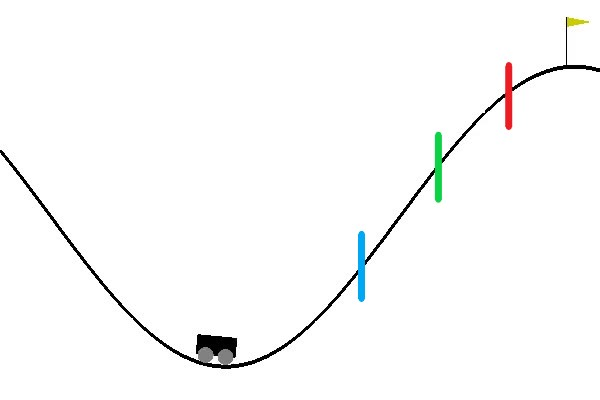

# Reinforcement Learning on OpenAI gym
Using the OpenAI gym to train an RL agent to play MountainCar.

### **Table of Contents**
   * [Project Aim](#project-aim)
   * [Libraries Used](#libraries-used)
   * [About the Environment](#about-the-environment)
   * [Running the code](#running-the-code)
       - [Testing the models](#testing-the-models)
       - [Training the models](#training-the-models)
   * [Results](#results)
   * [Observations and Shortcomings](#observations-and-shortcomings)

## Project Aim
The aim of the project is to demonstrate the use of reinforcement learning and compare its algorithms on the MountainCar environment. The agent must learn to climb to the top of the flag and gain maximum reward. I have written code and compared 4 different variations of reinforcement learning.

## Libraries Used
I have used Python in this project. The major frameworks I have used are:
* Keras
* OpenAI gym
* Numpy

The techniques used in this project are:

* Deep Q Learning
* Double Deep Q Learning 
* Experience Replay
* Prioritized Experience Replay.
* Fixed Targets Networks

## About the Environment
In this environment the goas
The MountainCar environment has two space states, which represent the position and velocity of the cart

| Num        | Observation       | Min  | Max|
| ------------- |:-------------:| -----:| -----: |
| 0      | position | -1.2 | 0.6 |
| 1     | velocity      |   -0.07 |0.07 |

The actions that can be taken by the agent are

| Num  | Action |
| ---- | ----- |
| 0 | Push Left |
| 1  | No Push |
| 2  | Push Right |

Reward Structure
The default reward structure is -1 for each time step until the goal position of 0.5 is reached. However this requires the agent to run many episodes before it reaches an otpimal policy. So to speed things up I changed the reward structure in the following way.

*Image Caption*
For every time step the cart get a reward of -1 as before. Additionally, the cart gets a reward of
- +10 beyond blue line
- +30 beyond green line
- +130 beyond red line

## Running the code
First, install all the libraries needed to run. Then download all the code files.

#### Testing the models
To simply test the trained agents one can use the model_test.py file to directly run the models provided in the results folder. You can play with and test the provided models without much effort.
1) Step 1:
Save the model_test.py file and the .h5 file you want to test in the same folder

2) Step 2:
Open a shell in that folder and run
`python model_test.py <MODEL_NAME.h5> <NUMBER_OF_EPISODES>`
For Example:
`python model_test.py DDQN+PER.h5 30`

#### Training the models
There are 4 variants of the algorithms that can be run, they all utilize Experience Replay and Fixed Networks. To train your own agent, you will need an Agent, QNetwork, and ReplayMemory file. Run the Agent file to train your network. The 4 variants are:
1) Deep Q Learning 
2) Double Deep Q Learning
3) Deep Q Learning with Prioritized Experience Replay
4) Double Deep Q Learning with Prioritized Experience Replay

## Results

While training the networks, I havent let the agents run for long periods of time which is why the advantages of one algorithm over the other are rather subtle. I have made provisions to plot episode length, epsilon decay, max reward, average reward and minimum reward. Here I have plotted the results of the 4 different variations. The keras models for each of these are present in the Results folder

  
  <em>Vanilla Deep Q Learning</em>

  
  <em>Double Deep Q Learning</em>

  
  <em>Deep Q Learning + PER</em>

  
  <em>Double Deep Q Learning + PER</em>

## Observations and Shortcomings
DDQN+PER are no doubt are a superior alternative than vanilla DQN, and this could also be seen in the results. However, if you were to run the trained models on the environments, this is what one would see.

  
  <em>Vanilla DQN. Episode Reward = 437</em>

  
  <em>Double Deep Q Learning along with Prioritized Experience Replay. Episode Reward = 648</em>

Using DDQN + PER, the cart does not reach the flag at all. If DDQN+ + PER is superior then why does this happen?
The reason is that since we have modified our reward structure to boost the learning of our agent, in the second case our agent has learnt to stay beyond the green and red line for as long as possible and hence win a bigger reward. 

